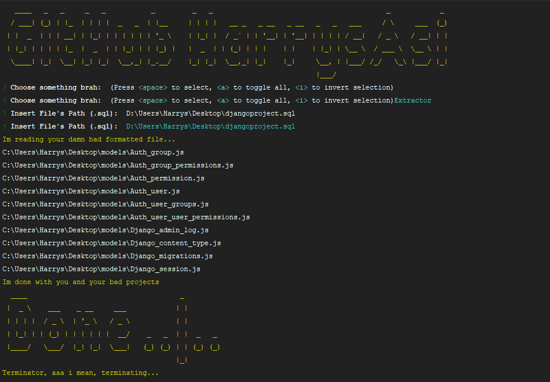

# ModelExtractor-Node-CLI
Node.js CLI application for personal usage. (Extract all models to js files from a .sql file formatted in classes) You can make the executables by executing pkg . (win, macOS, linux)

### Prerequisites - installing

```
npm install
```
```
npm start
```

Once you run the application

```
insert .sql file's path
```

```
Models will be extracted in the desktop of your computer inside a folder called "models"
```

## Versioning

We use git for versioning.

## Examples


## Authors

* ** Harrys Asimakopoulos ** - *Initial work* - (https://github.com/HarrysAsi/)

